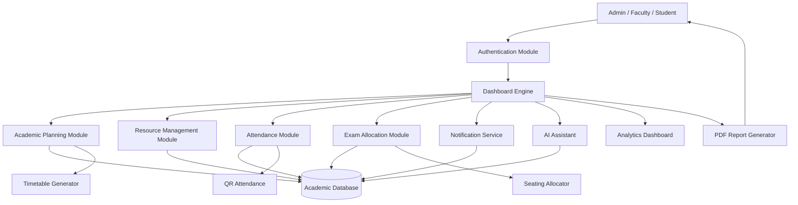

# DFD Diagram

```mermaid
flowchart TD
    A[Admin / Faculty / Student] --> B[Authentication Module]
    B --> C[Dashboard Engine]
    C --> D[Academic Planning Module]
    C --> E[Resource Management Module]
    C --> F[Attendance Module]
    C --> G[Exam Allocation Module]
    C --> H[Notification Service]
    C --> I[AI Assistant]
    D --> J[(Academic Database)]
    E --> J
    F --> J
    G --> J
    H --> J
    I --> J
    D --> K[Timetable Generator]
    F --> L[QR Attendance]
    G --> M[Seating Allocator]
    C --> N[Analytics Dashboard]
    C --> O[PDF Report Generator]
    O --> A
```
