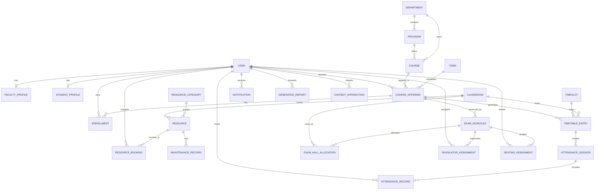

# ER Diagram

```mermaid
erDiagram
    USER ||--o| FACULTY_PROFILE : has
    USER ||--o| STUDENT_PROFILE : has
    DEPARTMENT ||--o{ PROGRAM : contains
    DEPARTMENT ||--o{ COURSE : owns
    PROGRAM ||--o{ COURSE : offers
    TERM ||--o{ COURSE_OFFERING : schedules
    COURSE ||--o{ COURSE_OFFERING : appears_in
    USER ||--o{ COURSE_OFFERING : teaches
    COURSE_OFFERING ||--o{ ENROLLMENT : has
    USER ||--o{ ENROLLMENT : joins
    CLASSROOM ||--o{ TIMETABLE_ENTRY : hosts
    TIMESLOT ||--o{ TIMETABLE_ENTRY : maps
    COURSE_OFFERING ||--o{ TIMETABLE_ENTRY : generates
    RESOURCE_CATEGORY ||--o{ RESOURCE : groups
    CLASSROOM ||--o{ RESOURCE : stores
    RESOURCE ||--o{ RESOURCE_BOOKING : booked_in
    USER ||--o{ RESOURCE_BOOKING : requests
    RESOURCE ||--o{ MAINTENANCE_RECORD : has
    TIMETABLE_ENTRY ||--o{ ATTENDANCE_SESSION : creates
    ATTENDANCE_SESSION ||--o{ ATTENDANCE_RECORD : includes
    USER ||--o{ ATTENDANCE_RECORD : marks
    COURSE_OFFERING ||--o{ EXAM_SCHEDULE : assessed_by
    EXAM_SCHEDULE ||--o{ EXAM_HALL_ALLOCATION : allocates
    EXAM_SCHEDULE ||--o{ INVIGILATOR_ASSIGNMENT : supervises
    EXAM_SCHEDULE ||--o{ SEATING_ASSIGNMENT : assigns
    CLASSROOM ||--o{ EXAM_HALL_ALLOCATION : used_as
    USER ||--o{ INVIGILATOR_ASSIGNMENT : assigned
    USER ||--o{ SEATING_ASSIGNMENT : seated
    USER ||--o{ NOTIFICATION : receives
    USER ||--o{ GENERATED_REPORT : requests
    USER ||--o{ CHATBOT_INTERACTION : initiates
```
